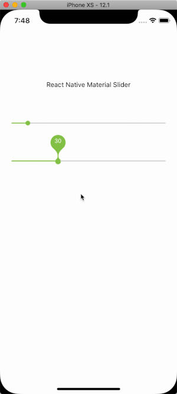

## Demo
Material Slider for React Native

[View on Snack](https://www.google.com)


## Demo
<div style="text-align:center">
  
</div>


## Installation

If using yarn:

```bash
yarn add react-native-material-slider
```

If using npm:

```bash
npm i react-native-material-slider -S
```

## Usage

```js
import Slider from 'react-native-material-slider';
```

Simply place a `<Slider />` tag.

## Props

You can configure module with this props

| Prop        | Type           | Default  |
| ------------- |:-------------:| -----:|
| `stickyPin` | boolean | false |
| `minimumValue` | number | 0 |
| `maximumValue` | number | 100 |
| `step` | number | 1 |
| `thumbTintColor` | string | transparent |
| `minimumTrackTintColor` | string | #8ec95d |
| `maximumTrackTintColor` | string | #d6d9db |
